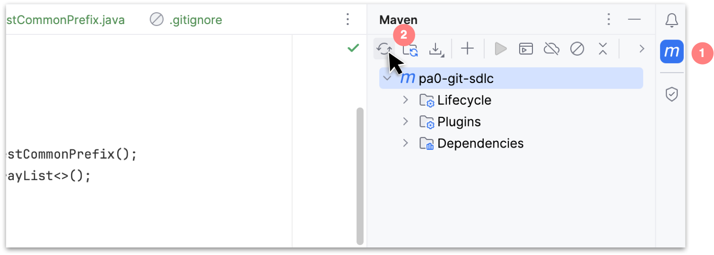
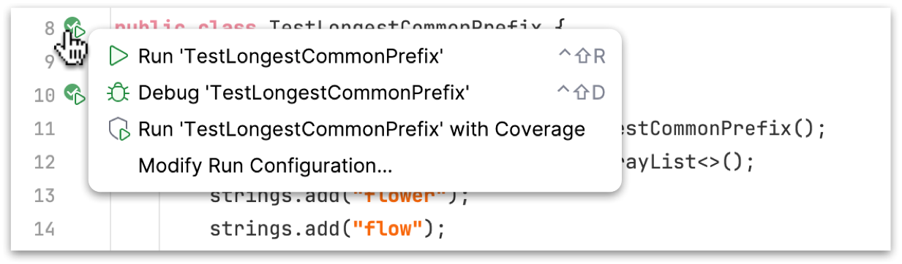

# `git`, the SDLC, and TDD -- oh my!

In this initial "pseudo-ish" :-) programming assignment, you'll practice debugging, test driven-development (TDD), and generally familiarize yourself in working with git and the terminal. I strongly recommend starting on this early in the event that you encounter process related issues -- such as commiting and/or pushing your work. 

This is to say: give yourself time to reach out to me or one of the course LAs/IAs/TAs.

## Part 1: Test Driven Development (TDD)

In this first part you'll practice: running tests, writing tests, identifying bugs using tests, and implementing corresponding fixes. You'll also learn some basic aspects of project maintenance (specifically related to dependencies and build scripts).

First, `cd` into the directory where you are storing your work for 311 this semester and clone this repo. Next, open the cloned repo in IntelliJ (`File > Open` then navigate to the cloned project folder on your hard drive). 

> Consult the **L**esson notes regarding use of the terminal and git under Module 02 on canvas (this is a pdf). Additionally, there is a video walkthrough of the terminal being used and doing some basic git operations on a sample project.

### Code Specification:

We are solving a classic interview problem, finding the longest prefix in an ArrayList of Strings. These types of problems feature heavily in interviews, as do problems involving String manipulation in general. Here is the problem statement for the longest common prefix problem:

> You must find the longest common prefix in an array of Strings. If there is no common prefix, return an empty string (i.e. ""). If there is a common prefix, return it as a String

#### Some examples:

- in this array ["flower", "flow", "flight"], we would return "fl" as the longest common prefix
- in this array ["flower", "flow"], we would return "flow"
- ["dog", "racecar", "car"], we would return ""
- in this array [], we would return "" as there are no strings at all

### Step 0: adding `jUnit` as a dependency

Rather than using the version of jUnit packaged with IntelliJ (as we did in a prior activity), the starter kit for this repo includes a **maven** `pom.xml` in the root directory of your cloned repo. There are build tools out there for Java (some more complicated than others) though maven is pretty much the de-facto standard, followed closely by **gradle**. 

Any serious project should maintain a build script -- even small to medium sized projects. These not only define how executables for the project get built, but they also declare and automatically pull-in any library dependencies your project might rely on. A simple, well written, and easy to understand build script is a nice, durable way of managing codebases long term (especially those that are reliant on many different libraries). 

First: you'll need to add a dependency for jUnit to a skeleton `pom.xml` included in the starter kit. Go to the maven (mvn) central repo [here](https://mvnrepository.com/) and search for `jUnit'. Select the one near the top with "jupiter api" in the title. Select whatever the most recent version is (for me, it's `5.10.1`). Once you click the version, you should see a dependency like so:

```
<dependency>
    <groupId>org.junit.jupiter</groupId>
    <!-- more will be here in the real dep. on mvn central repo -->
</dependency>
```
The `mvncentralrepo` website should supply you with the full xml for the dependency (including the version). Paste it within the`<dependencies>` block in your pom:

```
<dependencies>
    <!-- paste your jUnit jupiter dependency here -->
</dependencies>
```

Once you add this dependency, expand the tool window for maven and click reload:



This should pull in the jUnit dependency you added to the `pom.xml`.

### Step 1: review the existing prefix-finding code

In the blue `src` folder in the starter kit for this repo, you'll find an existing solution. Existing test cases are located in the green `test` folder.

Run the tests and ensure that they pass (you should see green play buttons in the gutter):



### Step 2: adding a test

Now add a new test where you pass an empty ArrayList to the `findLongestCommonPrefix` method. This test will fail, in fact, running the test should trigger a runtime exception (an `IndexOutOfBoundsException` to be precise). Figure out how to fix this.. hint: the method `findLongestCommonPrefix` should return an empty string ("") if there are no elements in the ArrayList. Include at least one assert in your added test.

### Step 3: (optional) 

Add some additional unit tests to improve code coverage and build overall confidence that the algorithm (as given) is working correctly. If you add a test and you find that it fails try to identify and fix the bug in the algorithm. If you find a but but can't figure out how adjust the algorithm leave a comment indicating this along with the failing test(s).

## Part 2: Agile, the Software Development Lifecycle (SDLC), and Process Modeling

From the Meyer course text, read the preface, chapter 1, and chapter 3, and section 7.5 (on TDD). Write a reflection - 3/4 of a page, 12pt font double spaced - outlining Meyer's view on Agile methods, some of the benefits, and what the author considers the downsides. Discuss at least two alternative (existing) SDLC process models. What's one his identified 'upsides' for the waterfall approach? Include in your answer some of his identified criticism of TDD in addition to your own thoughts.

Submit your reflection as a `.pdf` in the root directory of this project -- and be sure you commit it to version control! Then push your work.

# Handin

When you are ready to submit (or simply want to 'checkin' your work), open the terminal, cd to the project directory, make make a commit by typing:

> git commit -am "message goes here"

then follow this up with a

> git push origin main
